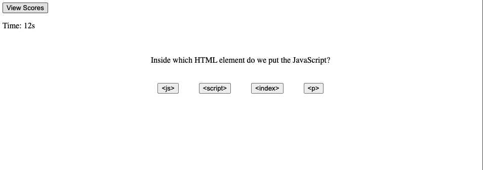

# Code-Quiz
Github Repo: https://github.com/SamiF812/Code-Quiz
Deployed App: https://samif812.github.io/Code-Quiz/

Created a code quiz that would test the users basic JavaScript knowledge

The quiz had a start button that would begin the quiz by bringing up the first question as well as start the timer.

After the question was responded to the next question will appear, if a question was answered incorrectly 5 seconds was subtracted from the remaining time.

The quiz was over when all answers have been submitted and or the timer hits 0.

Scoring for my quiz is based on the time remaining. So the goal is to put as many correct answers as possible quickly as possible and finish with as much time on the clock as you can for a higher score.

Once the quiz concludes the user is provdied with an input box to submit their initials. These initals get stored locally and are viewed on a scoreboard by pressing the view scores button.

I will add more css in the future, I mainly focused on making sure the quiz functioned properly.
